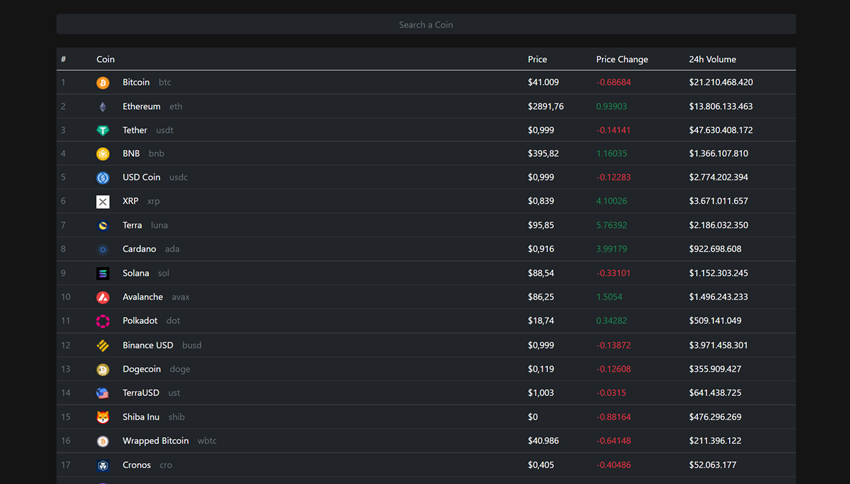

# CRIPTO MONEDAS PAGES

#### Tecnologias utilizadas

- React - Frontend;
- Bootstrap - Frontend;
- API - Coingecko api de criptomonedas;
- NPM  - Manejador de paquetes de javascript ;
------------

------------

## La base de arranque se utilizo create react aoo

[Create React App](https://github.com/facebook/create-react-app).

## Available Scripts

puedes ejecutar los siguientes comandos para arrancar la app:

### `npm start`

### `npm test`

### `npm run build`

### `npm run eject`

